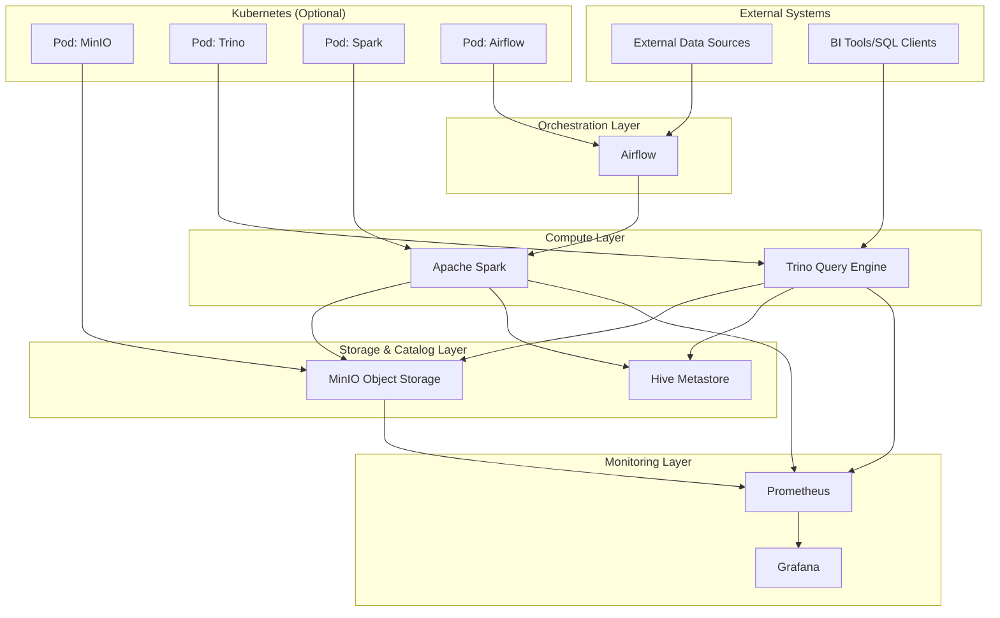

# Data Platform Architecture Diagram

## High-Level Architecture



## Component Breakdown

### 1. **External Systems**
- **Data Sources**: External databases, APIs, files
- **Clients**: BI tools (Tableau, Power BI), SQL clients, applications

### 2. **Orchestration Layer**
- **Apache Airflow**: Workflow management and scheduling
- **Features**: Hourly ETL scheduling, retry logic, monitoring

### 3. **Compute Layer**
- **Apache Spark**: ETL processing engine
  - Reads external data
  - Transforms and cleans data
  - Writes to Iceberg tables
- **Trino**: Distributed SQL query engine
  - Serves analytical queries
  - Supports concurrent users
  - Optimized for Iceberg tables

### 4. **Storage & Catalog Layer**
- **MinIO**: S3-compatible object storage
  - Stores Iceberg table data files
  - Cost-effective storage solution
- **Hive Metastore**: Metadata catalog
  - Stores Iceberg table metadata
  - Schema information
  - Table location mapping

### 5. **Monitoring Layer**
- **Prometheus**: Metrics collection
  - Trino query performance
  - Spark job execution
  - System resource usage
- **Grafana**: Visualization and alerting
  - Performance dashboards
  - System health monitoring

### 6. **Kubernetes (Bonus)**
- Container orchestration platform
- Auto-scaling capabilities
- High availability deployment
- Resource optimization

## Data Flow

1. **ETL Pipeline**:
   ```
   External Data → Airflow → Spark → Iceberg Tables → MinIO + Hive Metastore
   ```

2. **Query Flow**:
   ```
   BI Tools → Trino → Hive Metastore (metadata) → MinIO (data) → Results
   ```

3. **Monitoring Flow**:
   ```
   All Services → Prometheus → Grafana → Alerts/Dashboards
   ```

## Architecture Benefits

### **Scalability**
- Horizontal scaling of compute (Spark/Trino)
- Independent scaling of storage and compute
- Kubernetes auto-scaling capabilities

### **Cost Efficiency**
- Object storage for cheap data storage
- Separation of storage and compute
- Pay-per-use resource allocation

### **Performance**
- Iceberg metadata pruning
- Trino distributed query execution
- Spark optimized ETL processing

### **Reliability**
- ACID transactions via Iceberg
- Fault-tolerant processing
- Container-based deployment

### **Flexibility**
- Multiple query patterns supported
- Easy integration with external tools
- Cloud-native architecture