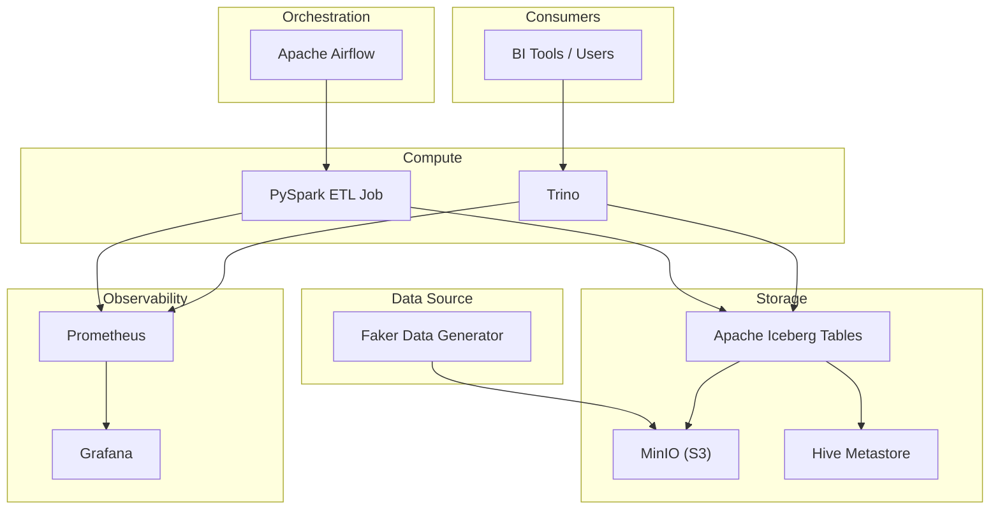

# LMWN Data Platform (Assignment 2)

## Overview

This project demonstrates a **modern data platform** built with **Apache Iceberg** as the table format.  
It supports scalable ETL, SQL analytics, and basic observability, following the requirements of the LMWN Data Platform Engineer take-home assignment.

The platform is designed to:
- Handle analytical workloads at scale
- Support multiple query patterns
- Be containerized and easy to run locally
- Be cost-aware by using open-source components

---

## Architecture

### Core Components

| Component | Purpose |
|--------|--------|
| **Apache Iceberg** | Table format with ACID, schema evolution, and time travel |
| **Apache Spark** | ETL and data transformation |
| **Trino** | Distributed SQL query engine |
| **MinIO** | S3-compatible object storage |
| **Hive Metastore** | Iceberg metadata catalog |
| **Apache Airflow** | Workflow orchestration |
| **Prometheus** | Metrics collection |
| **Grafana** | Metrics visualization |

---

### System Architecture Diagram



---

## Why This Architecture?

* **Iceberg + Trino** supports high-concurrency analytical queries
* **Spark** handles batch ETL efficiently
* **MinIO** provides low-cost object storage
* **Airflow** enables scheduled pipelines (e.g. daily or hourly jobs)
* **Containerization / Kubernetes** improves portability and scalability
* **Prometheus + Grafana** provide basic monitoring and observability

This design balances **scalability, cost, and simplicity**, which fits early-stage data platform adoption.

---

## Project Structure

```
assignment_2/
├── airflow/              # Airflow DAG and config
├── etl/                  # Spark ETL logic
├── spark/                # Spark image and configs
├── trino/                # Trino Iceberg catalog config
├── metastore/            # Hive metastore configuration
├── monitoring/           # Prometheus & Grafana configs
├── k8s/                  # Kubernetes manifests
├── secrets/              # Environment secrets
├── docker-compose.yml
├── Makefile
└── README.md
```

---

## Prerequisites

* Docker & Docker Compose
* Make
* Python 3.10+
* **uv** (Python dependency manager)

---

## Python Dependencies (uv)

This project uses **`uv`** for Python dependency management.

To run Python scripts locally:

```bash
uv run etl/etl_iceberg.py
```

Dependencies are resolved automatically without activating a virtual environment.

---

## Setup & Deployment

### Start the Platform

```bash
make up
```

This will start:

* Spark
* Airflow
* MinIO
* Hive Metastore
* Trino
* Prometheus
* Grafana

---

### Stop the Platform

```bash
make down
```

---

## ETL Pipeline

### What the ETL Does

* Generates or ingests external (synthetic) data
* Processes data using **Spark**
* Writes output as **Iceberg tables** stored in **MinIO**
* Registers metadata in **Hive Metastore**

### Run ETL

```bash
make etl
```

Or run directly with `uv`:

```bash
uv run etl/etl_iceberg.py
```

---

## Querying the Data

### Connect to Trino CLI

```bash
make trino
```

### Example Queries

```sql
-- Preview data
SELECT * FROM local.demo.sales LIMIT 10;

-- Monthly aggregation
SELECT
  date_trunc('month', order_date) AS month,
  SUM(amount) AS total_sales
FROM local.demo.sales
GROUP BY 1
ORDER BY 1;

-- Filter example
SELECT *
FROM local.demo.sales
WHERE product_category = 'Electronics';
```

Users can also connect via JDBC or BI tools using Trino.

---

## Monitoring & Observability

* **Prometheus** collects metrics from Spark and Trino
* **Grafana** visualizes system health and performance

Access Grafana:

* URL: `http://localhost:3000`

---

## Kubernetes (Bonus)

The `k8s/` directory contains example manifests for deploying the platform on Kubernetes, including:

* Spark
* Trino
* MinIO
* Airflow
* Prometheus
* Grafana

These manifests demonstrate how the platform can be scaled beyond local development.

---

## Makefile Commands

```bash
make up        # Start all services
make down      # Stop all services
make etl       # Run Spark ETL
make trino     # Connect to Trino CLI
```

---

## Summary

This project demonstrates:

* A scalable **Iceberg-based data platform**
* End-to-end ETL using Spark
* SQL analytics using Trino
* Workflow orchestration with Airflow
* Containerization and Kubernetes readiness
* Monitoring with Prometheus and Grafana